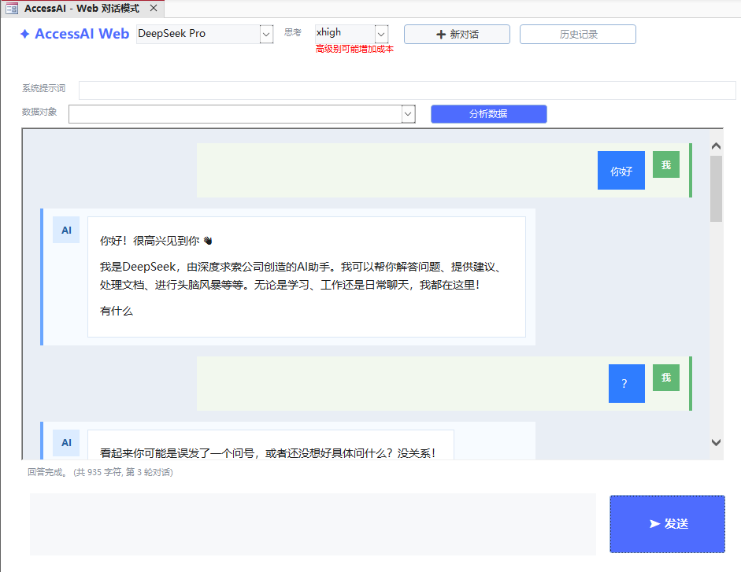

# AccessAI

[中文](#-功能特性) | [English](#-features)

**让 Microsoft Access 无缝对接 AI 大模型的开源 VBA 工具库**

> 在 Access 中一键调用 DeepSeek、通义千问、文心一言、Kimi、OpenAI、Gemini、GLM、豆包、腾讯混元、讯飞星火等 AI 大模型，支持流式输出、Markdown 渲染、打字机效果，开箱即用。


---



---

## ✨ 功能特性

- **多模型支持** — 内置 DeepSeek、通义千问、文心一言、Kimi、OpenAI、GLM、Gemini、豆包、腾讯混元、讯飞星火等模型，下拉框一键切换
- **AI 对话问答** — 在 Access 窗体中直接向 AI 提问，获取智能回答
- **对话历史记录** — 自动保持对话上下文，AI 能记住之前的对话内容，点击「新对话」重置
- **历史对话持久化** — 对话记录自动保存至 Access 数据表 `tblChatHistory`，关闭数据库后仍可查阅
- **历史会话管理** — 通过 `frmChatHistory` 窗体浏览、加载、删除历史会话
- **系统提示词配置** — 在主窗体中填写 System Prompt，统一控制 AI 的角色、语气和回答规则
- **思考强度配置** — 支持 `low` / `medium` / `high` / `xhigh` 档位，按需向兼容模型发送 `reasoning_effort` 参数；更高的思考级别可能会增加成本
- **Token 调用统计** — 每次请求后显示输入 Token、输出 Token 与合计 Token；优先使用 API 返回的 `usage`，无返回时自动估算
- **数据库对象分析** — 选择当前数据库中的表或查询，自动读取字段结构、记录数和样例数据交给 AI 分析
- **自定义 API 端点** — 支持配置任意 OpenAI 兼容 API，模型下拉框选择「自定义」后填写 URL、Key、模型名称
- **现代化 UI** — 参考 DeepSeek / Gemini 风格设计，白色背景 + 蓝紫色调，简洁美观
- **流式输出 (SSE)** — 基于 curl 的流式传输，实时逐字显示 AI 回答（Windows 10 1803+）
- **打字机效果** — 无 curl 环境自动降级为同步请求 + 打字机动画
- **Markdown 渲染** — 将 AI 返回的 Markdown 转为 Access 富文本 HTML，支持：
  - 标题（`#` ~ `######`）
  - **粗体**、*斜体*、***粗斜体***、~~删除线~~
  - `行内代码` 和代码块
  - 有序/无序列表
  - 引用块、水平线
  - 链接、图片提示
  - WebBrowser HTML 气泡模式支持 Markdown 表格渲染
- **一键建表单** — `CreateAIForm` 自动生成 AI 问答窗体，零手动配置
- **双对话模式** — 保留 Access 富文本模式，并新增 WebBrowser HTML 气泡对话模式
- **UTF-8 全面支持** — 中文输入/输出无乱码

## 📋 环境要求

| 项目 | 要求 |
|------|------|
| Microsoft Access | 2010 及以上（推荐 2016+） |
| Windows | 7 及以上（流式输出需 Windows 10 1803+） |
| VBA 引用 | Microsoft Scripting Runtime |
| AI API Key | DeepSeek、通义千问、文心一言、Kimi、OpenAI、GLM、Gemini、豆包、腾讯混元、讯飞星火等平台的 API Key（按需配置） |

## 🚀 快速开始

### 1. 导入模块

将以下两个 `.bas` 文件导入到你的 Access 数据库（VBA 编辑器 → 文件 → 导入文件）：

- `JsonConverter.bas` — JSON 解析库（[VBA-JSON](https://github.com/VBA-tools/VBA-JSON) by Tim Hall）
- `Module_Markdown.bas` — AI 调用 & Markdown 渲染核心模块

### 2. 添加引用

在 VBA 编辑器中：**工具 → 引用 → 勾选 `Microsoft Scripting Runtime`**

### 3. 配置 API Key

打开 `Module_Markdown` 模块，根据你要使用的 AI 模型，修改对应的 Key：

```vba
' DeepSeek
Private Const DS_KEY   As String = "你的-DeepSeek-Key"
Private Const DS_URL   As String = "https://api.deepseek.com/chat/completions"
Private Const DS_FLASH_MODEL As String = "deepseek-v4-flash"
Private Const DS_PRO_MODEL   As String = "deepseek-v4-pro"

' 通义千问 (阿里云百炼)
Private Const QW_KEY   As String = "你的-通义千问-Key"
Private Const QW_URL   As String = "https://dashscope.aliyuncs.com/compatible-mode/v1/chat/completions"
Private Const QW_MODEL As String = "qwen-plus"

' 文心一言 (百度千帆)
Private Const WX_KEY   As String = "你的-文心一言-Key"
Private Const WX_URL   As String = "https://qianfan.baidubce.com/v2/chat/completions"
Private Const WX_MODEL As String = "ernie-4.0-8k"

' Kimi (月之暗面)
Private Const KM_KEY   As String = "你的-Kimi-Key"
Private Const KM_URL   As String = "https://api.moonshot.cn/v1/chat/completions"
Private Const KM_MODEL As String = "moonshot-v1-8k"

' OpenAI
Private Const OA_KEY   As String = "你的-OpenAI-Key"
Private Const OA_URL   As String = "https://api.openai.com/v1/chat/completions"
Private Const OA_GPT55_MODEL As String = "gpt-5.5"
Private Const OA_GPT54_MODEL As String = "gpt-5.4"

' 智谱清言 GLM
Private Const GLM_KEY  As String = "你的-GLM-Key"
Private Const GLM_URL  As String = "https://open.bigmodel.cn/api/paas/v4/chat/completions"
Private Const GLM_FLASH_MODEL As String = "glm-4-flash"
Private Const GLM_PLUS_MODEL  As String = "glm-4-plus"

' Gemini (OpenAI 兼容接口)
Private Const GM_KEY   As String = "你的-Gemini-Key"
Private Const GM_URL   As String = "https://generativelanguage.googleapis.com/v1beta/openai/chat/completions"
Private Const GM_FLASH_MODEL As String = "gemini-1.5-flash"
Private Const GM_PRO_MODEL   As String = "gemini-1.5-pro"

' 豆包 / 腾讯混元 / 讯飞星火
' 继续在 Module_Markdown 的“AI 提供商配置”区域修改对应 KEY、URL、MODEL 即可
```

> 💡 只需配置你实际使用的模型的 Key，其他保持默认即可。

### 4. 创建窗体并使用

在 VBA 立即窗口中执行：

```vba
CreateAIForm
```

然后在 Access 中打开窗体 `frmAI`，从下拉框选择 AI 模型，输入问题，点击 **[提问]** 即可！

可选对话模式：

```vba
' 默认：Access 富文本对话模式
CreateAIForm

' 方案A：WebBrowser HTML 气泡对话模式
CreateAIWebForm
```

> 注意：`CreateAIWebForm` 会尝试自动创建 `Microsoft Web Browser` ActiveX 控件。部分 Access/Windows 环境可能无法通过 VBA 自动生成该控件，如窗体中未出现 WebBrowser 区域，请在 `frmAIWeb` 设计视图中手工添加 **Microsoft Web Browser** ActiveX 控件，并将控件名称改为 `wbChat`。

## 📁 项目结构

```
AccessAI/
├── AI.accdb                 # 示例 Access 数据库（含已导入的模块和窗体）
├── JsonConverter.bas        # JSON 解析模块 (VBA-JSON v2.3.1)
├── Module_Markdown.bas      # 核心模块：AI 调用 + Markdown 渲染 + 窗体生成 + 历史管理
├── 1.png                    # 界面截图
└── README.md                # 项目说明
```

## 🔧 核心模块说明

### Module_Markdown.bas

| 功能分区 | 说明 |
|----------|------|
| Markdown → 富文本 HTML | `MarkdownToRichText()` 将 Markdown 转为 Access 富文本控件支持的 HTML |
| AI API 调用 (多模型) | 支持 DeepSeek/通义千问/文心一言/Kimi/OpenAI/GLM/Gemini/豆包/腾讯混元/讯飞星火；支持 System Prompt 与思考强度 `reasoning_effort`；方案A：`StreamWithCurl` 流式 SSE；方案B：`SyncWithTypewriter` 同步+打字机 |
| 数据库对象分析 | 读取当前 Access 数据库中的表/查询，生成字段结构、记录数和前 30 行样例数据供 AI 分析 |
| 对话 UI 模式 | `CreateAIForm` 富文本模式；`CreateAIWebForm` WebBrowser HTML 气泡模式 |
| 对话历史持久化 | 自动建表 `tblChatHistory`，保存/加载/删除会话记录 |
| 窗体自动创建 | `CreateAIForm` 创建 AI 问答窗体；`CreateHistoryForm` 创建历史会话窗体；`CreateMarkdownForm` 创建 Markdown 查看器 |
| 工具函数 | SSE 解析、UTF-8 读写、JSON 序列化、正则辅助等 |

### 公开方法

```vba
' 创建 AI 问答窗体
CreateAIForm

' 创建历史会话管理窗体
CreateHistoryForm

' 打开历史会话管理窗体
ShowChatHistory

' 清除当前对话历史
ClearHistory

' 创建 Markdown 查看器窗体
CreateMarkdownForm

' 在弹出窗体中显示 Markdown 内容
ShowMarkdown "# 标题" & vbCrLf & "**正文**"

' 将 Markdown 写入指定富文本控件
SetTextBoxMarkdown Me.txtResult, sMarkdown
```

## 🗺️ 路线图

- [x] DeepSeek Flash / Pro 模型支持
- [x] 通义千问模型支持
- [x] 文心一言模型支持
- [x] Kimi 模型支持
- [x] OpenAI / Gemini / GLM / 豆包 / 腾讯混元 / 讯飞星火 支持
- [x] 思考强度 `low` / `medium` / `high` / `xhigh` 配置
- [x] Token 调用与返回统计
- [x] 多模型统一切换界面
- [x] 对话历史记录
- [x] 历史对话持久化存储与管理
- [x] 自定义 API 端点支持
- [x] 现代化 UI（DeepSeek / Gemini 风格）
- [x] 系统提示词 (System Prompt) 配置
- [x] 当前数据库表/查询分析
- [x] WebBrowser HTML 气泡对话模式

## 🐛 问题反馈

如果发现 Bug 或有改进建议，请：

- 提交 [Issue](https://github.com/miaowei2/accessdevelop/issues)
- 详细描述问题或建议
- 如可能，提供复现步骤

## 📄 许可证

本项目采用 MIT 许可证 - 详见 [LICENSE](LICENSE) 文件

## 👨‍💻 作者

**缪炜（will miao）**

现任微软最有价值专家（MVP），自媒体博主（公众号Access开发）

微软官方MVP主页地址：[@MVP](https://mvp.microsoft.com/zh-CN/MVP/profile/15c78eb8-1d9d-42de-9c15-afba24ec931d)
拥有丰富的企业级开发与培训经验，曾服务多家外企及知名合资企业，包括：麦格纳电子 (Magna)、飞利浦电子 (Philips)、卡特彼勒 (Caterpillar)、硕腾 (Zoetis)等。

项目经验：深耕企业数字化解决方案，通过 Access 独立架构或者其他语言开发过 ERP（企业资源计划）、WMS（仓储管理）、MES（生产执行）、CRM（客户关系）及 HR 等核心业务系统，具备极强的实战落地能力。熟悉：VBA、C#、JavaScript、SQL等开发语言。

## 📮 联系方式

- GitHub: [@miaowei2](https://github.com/miaowei2)
- email:will.miao@edonsoft.com
- 公众号：Access开发
- B站：[@Access开发易登软件](https://space.bilibili.com/10580232?spm_id_from=333.1007.0.0)
- 公司网站：[www.edonsoft.com](http://www.edonsoft.com)

## 🙏 致谢

感谢所有使用和贡献本项目的开发者！

---

# English

**An open-source VBA toolkit that seamlessly connects Microsoft Access to AI large language models.**

> Call DeepSeek, Qwen, ERNIE Bot, Kimi, OpenAI, Gemini, GLM, Doubao, Tencent Hunyuan, iFlytek Spark and other AI models directly from Access — with streaming output, Markdown rendering, and typewriter effects, ready to use out of the box.


---


---

## ✨ Features

- **Multi-Model Support** — Built-in support for DeepSeek, Alibaba Qwen, Baidu ERNIE, Kimi, OpenAI, GLM, Gemini, Doubao, Tencent Hunyuan, and iFlytek Spark — switch models via dropdown
- **AI Q&A Chat** — Ask AI questions directly from an Access form and get intelligent answers
- **Conversation History** — Automatically maintains conversation context so the AI remembers previous exchanges; click "New Chat" to reset
- **Persistent History Storage** — Conversations are automatically saved to an Access table `tblChatHistory` and persist across sessions
- **History Session Management** — Browse, load, and delete historical sessions via the `frmChatHistory` form
- **System Prompt Configuration** — Set a System Prompt in the main form to control the AI role, tone, and response rules
- **Reasoning Effort Configuration** — Supports `low` / `medium` / `high` / `xhigh` and sends `reasoning_effort` to compatible models when selected; higher reasoning levels may increase cost
- **Database Object Analysis** — Select a table or query from the current database and send schema, row count, and sample rows to AI for analysis
- **Custom API Endpoint** — Configure any OpenAI-compatible API by selecting “Custom” from the model dropdown and entering URL, Key, and Model name
- **Modern UI** — DeepSeek / Gemini-inspired design with clean white background and blue-purple accents
- **Streaming Output (SSE)** — Real-time token-by-token display via curl-based SSE streaming (Windows 10 1803+)
- **Typewriter Effect** — Automatic fallback to synchronous request + typewriter animation when curl is unavailable
- **Markdown Rendering** — Converts AI-returned Markdown to Access Rich Text HTML, supporting:
  - Headings (`#` through `######`)
  - **Bold**, *Italic*, ***Bold Italic***, ~~Strikethrough~~
  - `Inline code` and code blocks
  - Ordered / Unordered lists
  - Blockquotes, horizontal rules
  - Links, image placeholders
- **One-Click Form Creation** — `CreateAIForm` auto-generates the AI Q&A form with zero manual configuration
- **Two Chat UI Modes** — Access Rich Text mode and WebBrowser HTML bubble chat mode
- **Full UTF-8 Support** — No garbled text for Chinese or other multibyte characters

## 📋 Requirements

| Item | Requirement |
|------|-------------|
| Microsoft Access | 2010 or later (2016+ recommended) |
| Windows | 7 or later (streaming requires Windows 10 1803+) |
| VBA Reference | Microsoft Scripting Runtime |
| AI API Key | API Keys from DeepSeek, Alibaba Qwen, Baidu ERNIE, Kimi, OpenAI, GLM, Gemini, Doubao, Tencent Hunyuan, iFlytek Spark, or another OpenAI-compatible provider (configure as needed) |

## 🚀 Quick Start

### 1. Import Modules

Import the following `.bas` files into your Access database (VBA Editor → File → Import File):

- `JsonConverter.bas` — JSON parsing library ([VBA-JSON](https://github.com/VBA-tools/VBA-JSON) by Tim Hall)
- `Module_Markdown.bas` — Core module for AI calls & Markdown rendering

### 2. Add Reference

In the VBA Editor: **Tools → References → Check `Microsoft Scripting Runtime`**

### 3. Configure API Key

Open the `Module_Markdown` module and update the API Keys for the models you want to use:

```vba
' DeepSeek
Private Const DS_KEY   As String = "your-DeepSeek-Key"
Private Const DS_URL   As String = "https://api.deepseek.com/chat/completions"
Private Const DS_FLASH_MODEL As String = "deepseek-v4-flash"
Private Const DS_PRO_MODEL   As String = "deepseek-v4-pro"

' Alibaba Qwen (通义千问)
Private Const QW_KEY   As String = "your-Qwen-Key"
Private Const QW_URL   As String = "https://dashscope.aliyuncs.com/compatible-mode/v1/chat/completions"
Private Const QW_MODEL As String = "qwen-plus"

' Baidu ERNIE (文心一言)
Private Const WX_KEY   As String = "your-ERNIE-Key"
Private Const WX_URL   As String = "https://qianfan.baidubce.com/v2/chat/completions"
Private Const WX_MODEL As String = "ernie-4.0-8k"

' Kimi (Moonshot AI)
Private Const KM_KEY   As String = "your-Kimi-Key"
Private Const KM_URL   As String = "https://api.moonshot.cn/v1/chat/completions"
Private Const KM_MODEL As String = "moonshot-v1-8k"

' OpenAI
Private Const OA_KEY   As String = "your-OpenAI-Key"
Private Const OA_URL   As String = "https://api.openai.com/v1/chat/completions"
Private Const OA_GPT55_MODEL As String = "gpt-5.5"
Private Const OA_GPT54_MODEL As String = "gpt-5.4"

' GLM (BigModel)
Private Const GLM_KEY  As String = "your-GLM-Key"
Private Const GLM_URL  As String = "https://open.bigmodel.cn/api/paas/v4/chat/completions"
Private Const GLM_FLASH_MODEL As String = "glm-4-flash"
Private Const GLM_PLUS_MODEL  As String = "glm-4-plus"

' Gemini (OpenAI-compatible endpoint)
Private Const GM_KEY   As String = "your-Gemini-Key"
Private Const GM_URL   As String = "https://generativelanguage.googleapis.com/v1beta/openai/chat/completions"
Private Const GM_FLASH_MODEL As String = "gemini-1.5-flash"
Private Const GM_PRO_MODEL   As String = "gemini-1.5-pro"

' Doubao / Tencent Hunyuan / iFlytek Spark
' Update the corresponding KEY, URL, and MODEL constants in the AI provider configuration area of Module_Markdown.
```

> 💡 You only need to configure the Key for the model(s) you actually use.

### 4. Create Form and Go

Run in the VBA Immediate Window:

```vba
CreateAIForm
```

Then open the form `frmAI` in Access, select an AI model from the dropdown, type your question, and click **[Ask]**!

Optional chat UI modes:

```vba
' Default: Access Rich Text chat mode
CreateAIForm

' Plan A: WebBrowser HTML bubble chat mode
CreateAIWebForm
```

> Note: `CreateAIWebForm` attempts to create the `Microsoft Web Browser` ActiveX control automatically. Some Access/Windows environments may not allow VBA to create this control. If the WebBrowser area is missing, open `frmAIWeb` in Design View, manually add the **Microsoft Web Browser** ActiveX control, and rename the control to `wbChat`.

## 📁 Project Structure

```
AccessAI/
├── AI.accdb                 # Sample Access database (modules & forms included)
├── JsonConverter.bas        # JSON parsing module (VBA-JSON v2.3.1)
├── Module_Markdown.bas      # Core module: AI calls + Markdown rendering + form generation + history management
├── 1.png                    # Interface screenshot
└── README.md                # Project documentation
```

## 🔧 Core Module Reference

### Module_Markdown.bas

| Section | Description |
|---------|-------------|
| Markdown → Rich Text HTML | `MarkdownToRichText()` converts Markdown to HTML supported by Access Rich Text controls |
| AI API Calls (Multi-Model) | Supports DeepSeek/Qwen/ERNIE/Kimi/OpenAI/GLM/Gemini/Doubao/Tencent Hunyuan/iFlytek Spark; supports System Prompt and `reasoning_effort`; Plan A: `StreamWithCurl` for SSE streaming; Plan B: `SyncWithTypewriter` for sync + typewriter |
| Database Object Analysis | Reads tables/queries from the current Access database and sends schema, row count, and the first 30 sample rows to AI |
| Chat UI Modes | `CreateAIForm` for Rich Text mode; `CreateAIWebForm` for WebBrowser HTML bubble mode |
| Persistent Chat History | Auto-creates `tblChatHistory` table; saves/loads/deletes session records |
| Auto Form Creation | `CreateAIForm` creates the AI Q&A form; `CreateHistoryForm` creates the history session form; `CreateMarkdownForm` creates a Markdown viewer |
| Utilities | SSE parsing, UTF-8 read/write, JSON serialization, regex helpers, etc. |

### Public Methods

```vba
' Create AI Q&A form
CreateAIForm

' Create history session management form
CreateHistoryForm

' Open history session management form
ShowChatHistory

' Clear current conversation history
ClearHistory

' Create Markdown viewer form
CreateMarkdownForm

' Display Markdown in a popup form
ShowMarkdown "# Title" & vbCrLf & "**Body text**"

' Write Markdown to a specific Rich Text control
SetTextBoxMarkdown Me.txtResult, sMarkdown
```

## 🗺️ Roadmap

- [x] DeepSeek Flash / Pro model support
- [x] Alibaba Qwen model support
- [x] Baidu ERNIE model support
- [x] Kimi model support
- [x] OpenAI / Gemini / GLM / Doubao / Tencent Hunyuan / iFlytek Spark support
- [x] Reasoning effort `low` / `medium` / `high` / `xhigh` configuration
- [x] Unified multi-model switching UI
- [x] Conversation history
- [x] Persistent history storage & session management
- [x] Custom API endpoint support
- [x] Modern UI (DeepSeek / Gemini style)
- [x] System Prompt configuration
- [x] Current database table/query analysis
- [x] WebBrowser HTML bubble chat mode

## 🐛 Bug Reports

If you find a bug or have a suggestion:

- Submit an [Issue](https://github.com/miaowei2/accessdevelop/issues)
- Describe the problem or suggestion in detail
- Include reproduction steps if possible

## 📄 License

This project is licensed under the MIT License — see the [LICENSE](LICENSE) file for details.

## 👨‍💻 Author

**Will Miao (缪炜)**

Microsoft Most Valuable Professional (MVP) and content creator (WeChat Official Account: Access开发).

Microsoft MVP profile: [@MVP](https://mvp.microsoft.com/zh-CN/MVP/profile/15c78eb8-1d9d-42de-9c15-afba24ec931d)

Extensive experience in enterprise-level development and training, having served multinational and joint-venture companies including Magna Electronics, Philips, Caterpillar, Zoetis, among others.

Specializes in enterprise digital solutions, having independently architected or co-developed ERP, WMS, MES, CRM, and HR systems using Access and other technologies. Proficient in VBA, C#, JavaScript, SQL, and more.

## 📮 Contact

- GitHub: [@miaowei2](https://github.com/miaowei2)
- Email: will.miao@edonsoft.com
- WeChat Official Account: Access开发
- Bilibili: [@Access开发易登软件](https://space.bilibili.com/10580232?spm_id_from=333.1007.0.0)
- Website: [www.edonsoft.com](http://www.edonsoft.com)

## 🙏 Acknowledgments

Thanks to all developers who use and contribute to this project!
